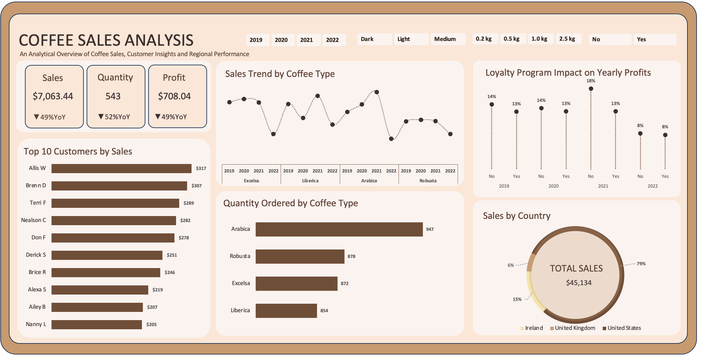

# Coffee Sales Analysis

## 📌 Project Overview  
This project analyzes 4 years of coffee sales data across multiple countries to uncover trends, customer behavior, and profitability drivers.  
The goal is to provide data-driven insights into sales growth, customer loyalty, and market opportunities.  

## 📊 Dataset  
The dataset (publicly available) contains 3 sheets:  

- **Orders Table**: Order ID, Order Date, Customer ID, Product ID, Quantity  
- **Customer Table**: Customer ID, Customer Names, Country, Loyalty Card  
- **Product Table**: Coffee Type, Roast Type, Size, Unit Price, Profit  

🔗 [Access the Dataset Here](https://docs.google.com/spreadsheets/d/1Y3J_MoAcjQcvUL0q7xdLnRTsmFI310m-/edit?gid=1074066047#gid=1074066047)

---

## 🛠 Tools Used  
- **Microsoft Excel** → Data Cleaning, Transformation, Analysis, Dashboard Building  

---

## 📈 Key Analysis & Insights  

### 1. Sales Trends by Coffee Type  
- Sales grew steadily from **2019 to 2021** across all coffee varieties.  
- A sharp decline in 2022 was observed, partly due to **missing Q4 2022 sales records**.  
- Emphasizes the importance of complete data capture for accurate monitoring.  

### 2. Top 10 Customers by Sales  
- Top 10 customers contributed significantly to total sales, ranging from **$205 to $317**.  
- Indicates **consistent purchasing behavior** among loyal customers.  
- Mid-tier customers present opportunities for growth through loyalty or personalized offers.  

### 3. Sales by Country  
- **U.S. dominates** sales, while **U.K. and Ireland** contribute marginally.  
- Highlights reliance on a single market and the need for diversification.  

### 4. Coffee Type Preferences  
- **Arabica** is the most popular coffee type.  
- **Robusta, Excelsa, Liberica** show balanced but lower demand.  
- Suggests prioritizing Arabica while promoting other varieties to optimize sales mix.  

### 5. Loyalty Program Impact  
- Loyalty customers provide **stable recurring revenue**.  
- However, contribution has plateaued, program needs **enhanced incentives** to drive incremental growth.  

### 6. KPI Performance (YoY Change)  
- Sales ↓ **49%**, Profit ↓ **49%**, Quantity ↓ **52%** (partly due to missing Q4 2022).  
- Still indicates contraction in engagement & revenue,corrective actions needed.  

---

## 📌 Recommendations  

- **Market Diversification**: Increase marketing efforts in the U.K. and Ireland to reduce reliance on the U.S.  
- **Customer Engagement**: Strengthen loyalty program with tiered rewards, referral bonuses, and exclusive discounts.  
- **Mid-tier Growth**: Target mid-tier customers with personalized offers to drive higher spending.  
- **Product Strategy**: Prioritize Arabica while balancing inventory & marketing for other varieties.  
- **Data Accuracy**: Ensure complete and consistent sales recording, especially for year-end periods.  

---

## ✅ Conclusion  
The analysis shows:  
- Arabica dominates demand.  
- Sales are concentrated in the U.S., exposing market risk.  
- Loyalty programs provide steady but modest contributions.  
- Top 10 customers drive significant sales, but mid-tier engagement is underutilized.  
- 2022 decline partly due to missing data,corrective measures and diversification are key for growth.  

---

## 📊 Dashboard  
Here’s the interactive Excel dashboard summarizing sales, quantity, and profit:  

  

---

## Full Report

- [Download the Full Report (PDF)](Assets/Coffee_Full_Report.pdf)  
- [Read the Full Report on Medium](YOUR_MEDIUM_LINK)  
